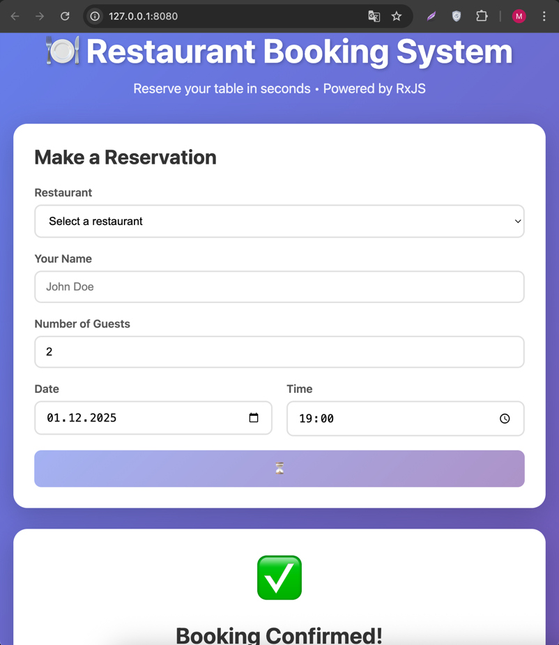

Установке проектных зависимостей
cd api-service
npm install --legacy-peer-deps

cd booking-service
npm install --legacy-peer-deps

# В корне restaurant-booking/
pwd
docker-compose up -d

cd api-service
npm run start:dev

cd booking-service
npm run start

Запуск фронта
cd frontend
npm i
npx http-server -p 8080 -c-1

